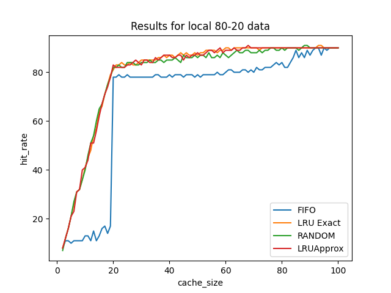
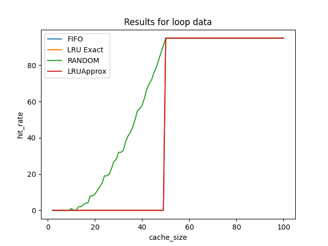
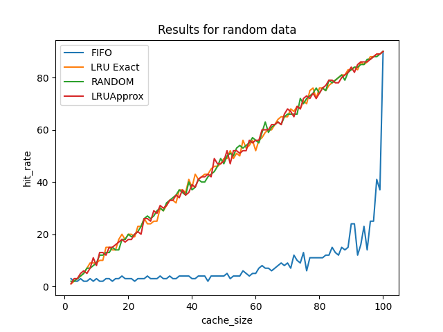

Policies: LRU (exact and approx), FIFO, Random
Workloads: 80-20, looping, random

*Note: In the code, 80-20 is mentioned as local.*

Note - For running the file and directly seeing the plots just type make command

Performance and analysis of each policy -

1. FIFO- It needs to remember the order of pages entered into the cache. It is highly ineffective in the case of loop data. It takes O(cache_size) space and also the O(n) time in worst case. Where n is the number of pages stored currently.
2. LRU approx - It also takes O(cahce_size) space and also the O(n) time in the worst case. Where n is the number of pages stored currently.
But its performance is way better than the FIFO due to the consideration of frequency of usage.
3. LRU - similar to LRU approx 
4. Random - It is very cheap in terms of memory and time as it takes O(1) space and O(n) time in worst cases. But it has low efficiency.

Here are the images of their performance

